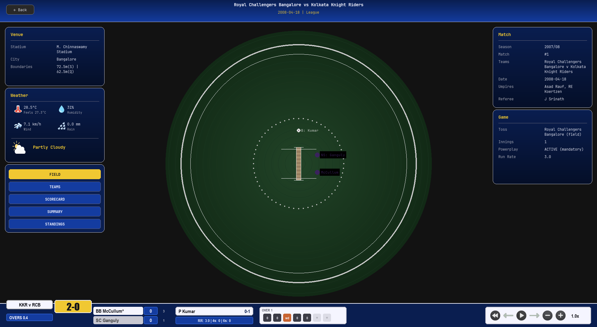

<div align="center">

# *IPL VIZ*

**Real-Time IPL Match Replay & Visualization Engine**

[](https://python.org)
[](https://pygame.org)
[](LICENSE)
[](https://cricsheet.org)
[](https://docs.astral.sh/uv/)
[](https://github.com/manojpisini/ipl-viz/releases)

<br>

*A broadcast-grade cricket analytics dashboard that replays every ball of every IPL match from 2008–2025, rendered in a TV-style interface with live weather, tactical fielding overlays, and ball-by-ball state management.*

<sup>🏎️ Inspired by <a href="https://github.com/IAmTomShaw/f1-race-replay"><b>F1 Race Replay</b></a> by Tom Shaw</sup>

<br>



</div>

---

## 📋 Overview

**ipl-viz** is a desktop application that transforms raw [Cricsheet](https://cricsheet.org) JSON match data into an interactive, ball-by-ball replay experience. Every delivery is parsed into a typed event, fed through an immutable state reducer, and rendered across multiple synchronized views — all at 60 FPS.

The engine treats each match as a **timeline of immutable state transitions**, borrowing patterns from event-sourcing architectures. The result is a deterministic, seekable replay where any ball can be jumped to instantly with full state reconstruction.

---

## ⚡ Feature Highlights

<table>
<tr>
<td width="50%" valign="top">

### 🏏 Ball-by-Ball Replay Engine
Deterministic timeline with play, pause, seek, and variable-speed playback (`0.5×` to `4.0×`). Every delivery updates an immutable `MatchState` through a pure reducer function — no side effects, no drift.

</td>
<td width="50%" valign="top">

### 🗺️ Tactical Fielding Overlay
Real-time fielding position visualization with labeled player markers, batting/bowling ends, and arc-rendered team names — rendered directly onto a scaled stadium diagram derived from actual ground dimensions.

</td>
</tr>
<tr>
<td width="50%" valign="top">

### 📊 Live Scorecard & Statistics
Tabbed batting/bowling scorecards with per-player breakdowns (runs, balls, 4s, 6s, SR for batters; overs, maidens, runs, wickets, economy for bowlers). Auto-switches between innings views.

</td>
<td width="50%" valign="top">

### 🌦️ Historical Weather Integration
Fetches actual match-day weather from Open-Meteo's archive API — temperature, humidity, wind speed, rain, and "feels like" — cached locally to avoid redundant network calls.

</td>
</tr>
<tr>
<td width="50%" valign="top">

### 🏆 Points Table & Playoffs
Season standings with NRR calculations and a matplotlib-rendered playoff bracket. Covers all 18 IPL seasons (2008–2025) with historical winner annotations.

</td>
<td width="50%" valign="top">

### 🏟️ Stadium-Aware Rendering
37+ real IPL venues with actual dimensions (width, length, straight/square boundaries, lat/lon). Fuzzy venue-name matching resolves Cricsheet inconsistencies automatically.

</td>
</tr>
</table>

---

## 🏗️ Architecture

```
ipl-viz/
│
├── main.py                    # Application entry point & game loop (IPLVizApp)
│
├── engine/                    # Core match engine — pure logic, no rendering
│   ├── events.py              # BallEvent frozen dataclass (slots=True)
│   ├── state.py               # MatchState, PlayerStats, BowlerStats (immutable)
│   ├── parser.py              # Cricsheet JSON → List[BallEvent] transformer
│   ├── reducer.py             # apply_ball(state, event) → new MatchState
│   ├── timeline.py            # Seekable timeline with variable-speed playback
│   ├── stadium.py             # Stadium dataclass (dimensions, coordinates)
│   └── weather.py             # Open-Meteo API client with JSON file cache
│
├── data_io/                   # I/O layer — file system & network boundary
│   ├── cricsheet.py           # Raw JSON extraction utilities
│   ├── match_context.py       # Stadium resolution + weather fetch orchestration
│   └── season_index.py        # Season/match file discovery & indexing
│
├── render/                    # Pygame rendering — view layer
│   ├── field.py               # Cricket ground renderer (pitch, boundary, zones)
│   ├── tactical_overlay.py    # Fielding positions, player labels, arc text
│   ├── scorecard.py           # Batting & bowling scorecard tables
│   ├── team_view.py           # Team rosters & match officials display
│   └── points_table.py        # Season standings + matplotlib playoff bracket
│
├── ui/                        # Reusable UI components
│   ├── hud.py                 # Playback controls (play/pause/speed/restart)
│   ├── panels.py              # Info panels (venue, weather, match, game)
│   ├── match_table.py         # Paginated match selector with sort/search
│   ├── dropdown.py            # Season selector dropdown
│   ├── title_bar.py           # Match header with team names & date
│   └── view_selector.py       # View mode tab switcher
│
├── data/                      # Static data & registries
│   ├── ipl_json/              # 1170 Cricsheet match files (2008–2025)
│   ├── team_registry.py       # Canonical team colors, hex, abbreviations
│   ├── theme.py               # TV broadcast color palette & layout tokens
│   ├── stadium_lookup.py      # 37+ venue definitions with coordinates
│   ├── field_tactics.py       # Fielding position coordinate mappings
│   ├── points_table.json      # Pre-computed season standings
│   └── playoffs.json          # Playoff bracket data per season
│
└── images/                    # Visual assets
    ├── controls/              # HUD icons (play, pause, rewind, speed)
    └── weather/               # Weather condition icons (sun, rain, etc.)
```

<details>
<summary><strong>📐 Data Flow Diagram</strong></summary>

<br>

```
┌─────────────┐     ┌──────────────┐     ┌───────────────┐
│  Cricsheet   │────▶│   parser.py  │────▶│ List[BallEvent]│
│  JSON File   │     │ (transform)  │     │  (immutable)   │
└─────────────┘     └──────────────┘     └───────┬───────┘
                                                  │
                                                  ▼
                                         ┌───────────────┐
                                ┌───────▶│  Timeline      │
                                │        │ (seek/play/dt) │
                                │        └───────┬───────┘
                                │                │ current event
                                │                ▼
┌─────────────┐     ┌──────────┴──┐     ┌───────────────┐
│   Stadium    │────▶│  Renderer   │◀────│  reducer.py   │
│  Dimensions  │     │ (60 FPS)    │     │ apply_ball()  │
└─────────────┘     └──────┬──────┘     └───────────────┘
                           │                     │
                           ▼                     ▼
                    ┌─────────────┐     ┌───────────────┐
                    │  Pygame     │     │  MatchState   │
                    │  Display    │     │  (immutable)  │
                    └─────────────┘     └───────────────┘
```

</details>

<details>
<summary><strong>🔀 State Management Pattern</strong></summary>

<br>

The engine follows a **unidirectional data flow** inspired by Redux/Elm:

1. **Event Source**: Cricsheet JSON → immutable `BallEvent` objects
2. **State Store**: `MatchState` — a frozen, slotted dataclass. Never mutated.
3. **Reducer**: `apply_ball(state, event) → new_state` — pure function, no side effects
4. **Timeline**: Controls which event is "current" via seek/play mechanics
5. **Views**: Read `MatchState` + `BallEvent` and render. No write-back.

This architecture makes the entire replay **deterministic and seekable** — you can jump to ball 47 of the second innings and the full match state is reconstructed from scratch.

</details>

---

## 🚀 Quick Start

### Prerequisites

| Requirement | Version | Purpose |
|---|---|---|
| **Python** | `≥ 3.13` | Runtime |
| **uv** | Latest | Package manager (recommended) |
| **System font** | JetBrainsMono NF | UI rendering (fallback: Arial) |

### Installation

```bash
# Clone the repository
git clone https://github.com/your-username/ipl-viz.git
cd ipl-viz

# Install dependencies with uv (recommended)
uv sync

# Alternatively, download the latest standalone executable
# [Download for Windows](https://github.com/manojpisini/ipl-viz/releases/latest)

# Or with pip
pip install -r requirements.txt
```

### Launch

```bash
# With uv
uv run python main.py

# Or directly
python main.py
```

The application opens in a resizable window at 92% of your screen resolution.

---

## 🎮 Controls

### Match Selection Screen

| Action | Control |
|---|---|
| Select season | Dropdown (top-right) |
| Select match | Click any row in the match table |
| Navigate pages | `◀` / `▶` buttons at table footer |

### Match Replay Screen

| Action | Control |
|---|---|
| Play / Pause | `Space` or HUD ▶️ button |
| Next ball | `→` Arrow |
| Previous ball | `←` Arrow |
| Speed up | HUD `⏩` button (max `4.0×`) |
| Slow down | HUD `⏪` button (min `0.5×`) |
| Restart | HUD `⏮` button |
| Return to selection | `Esc` or `← Back` button |

### View Modes

Switch between views using the sidebar tab selector:

| View | Description |
|---|---|
| **🏏 Field** | Stadium diagram + tactical fielding overlay with live positions |
| **👥 Teams** | Team rosters, playing XI, and match officials |
| **🏏 Batting** | Detailed batting scorecard (runs, balls, 4s, 6s, SR) |
| **🎳 Bowling** | Detailed bowling scorecard (overs, runs, wickets, economy) |
| **🏆 Points** | Season standings table + playoff bracket visualization |

---

## 📦 Dependencies

| Package | Version | Role |
|---|---|---|
| `pygame` | `≥ 2.6.1` | Rendering engine, event loop, font system |
| `matplotlib` | `≥ 3.10.8` | Playoff bracket visualization (Agg backend) |
| `pandas` | `≥ 3.0.0` | Points table data processing |
| `requests` | `≥ 2.32.5` | Open-Meteo weather API client |
| `pymunk` | `≥ 7.2.0` | Physics primitives for field geometry |
| `graphviz` | `≥ 0.21` | Graph rendering utilities |

---

## ⚙️ Configuration

All runtime constants are defined in `main.py::Config`:

| Parameter | Default | Description |
|---|---|---|
| `FPS` | `60` | Target frame rate (vsync-locked) |
| `BG_COLOR` | `(18, 18, 18)` | Application background color |
| `HEADER_HEIGHT` | `72` | Title bar height in pixels |
| `P_MATCH` | `260` | Match info panel height |
| `P_GAME` | `240` | Game status panel height |
| `P_VENUE` | `190` | Venue info panel height |
| `P_WEATHER` | `240` | Weather panel height |

<details>
<summary><strong>🌡️ Weather API Configuration</strong></summary>

<br>

Weather data is fetched from [Open-Meteo Archive API](https://open-meteo.com/) and cached to `data/weather_cache.json`.

| Setting | Value | Location |
|---|---|---|
| Endpoint | `archive-api.open-meteo.com/v1/archive` | `engine/weather.py` |
| User-Agent | `IPLViz/1.0` | `engine/weather.py` |
| Cache file | `data/weather_cache.json` | Auto-created |
| Target hour | `19:00` local time (index 19) | Match evening start |

**No API key required.** Open-Meteo is free for non-commercial use.

</details>

---

## 🛡️ System Health

| Metric | Target | Mechanism |
|---|---|---|
| Frame Rate | `60 FPS` (vsync) | `pygame.display.set_mode(vsync=1)` |
| Font Allocation | `0 per frame` | Lazy-init singletons via `_get_*_font()` |
| State Mutations | `0` (immutable) | `@dataclass(frozen=True, slots=True)` |
| Memory per Event | Minimized | `slots=True` eliminates `__dict__` overhead |
| Network Calls | `1 per venue/date` | JSON file cache in `data/weather_cache.json` |
| Debug Output | `0 print()` calls | All diagnostics via `logging` module |

---

## 📊 Data Source

Match data is sourced from [Cricsheet](https://cricsheet.org) in JSON format, covering **1,170 IPL matches** across **18 seasons** (2008–2025).

<details>
<summary><strong>📁 Data File Structure</strong></summary>

<br>

Each match file in `data/ipl_json/` follows the Cricsheet JSON schema:

```json
{
  "info": {
    "city": "Mumbai",
    "venue": "Wankhede Stadium",
    "dates": ["2024-03-22"],
    "teams": ["Mumbai Indians", "Chennai Super Kings"],
    "toss": { "winner": "...", "decision": "bat" },
    "outcome": { "winner": "...", "by": { "runs": 20 } },
    "player_of_match": ["..."],
    "overs": 20
  },
  "innings": [
    {
      "team": "...",
      "overs": [
        {
          "over": 0,
          "deliveries": [
            {
              "batter": "...",
              "bowler": "...",
              "runs": { "batter": 4, "extras": 0, "total": 4 }
            }
          ]
        }
      ]
    }
  ]
}
```

</details>

---

## 🤝 Contributing

1. Fork the repository
2. Create a feature branch (`git checkout -b feature/wagon-wheel`)
3. Commit changes (`git commit -m "Add wagon wheel overlay"`)
4. Push to branch (`git push origin feature/wagon-wheel`)
5. Open a Pull Request

---

<div align="center">

**Built with 🏏 for the IPL community**

*Data provided by [Cricsheet](https://cricsheet.org) • Weather by [Open-Meteo](https://open-meteo.com)*

</div>
